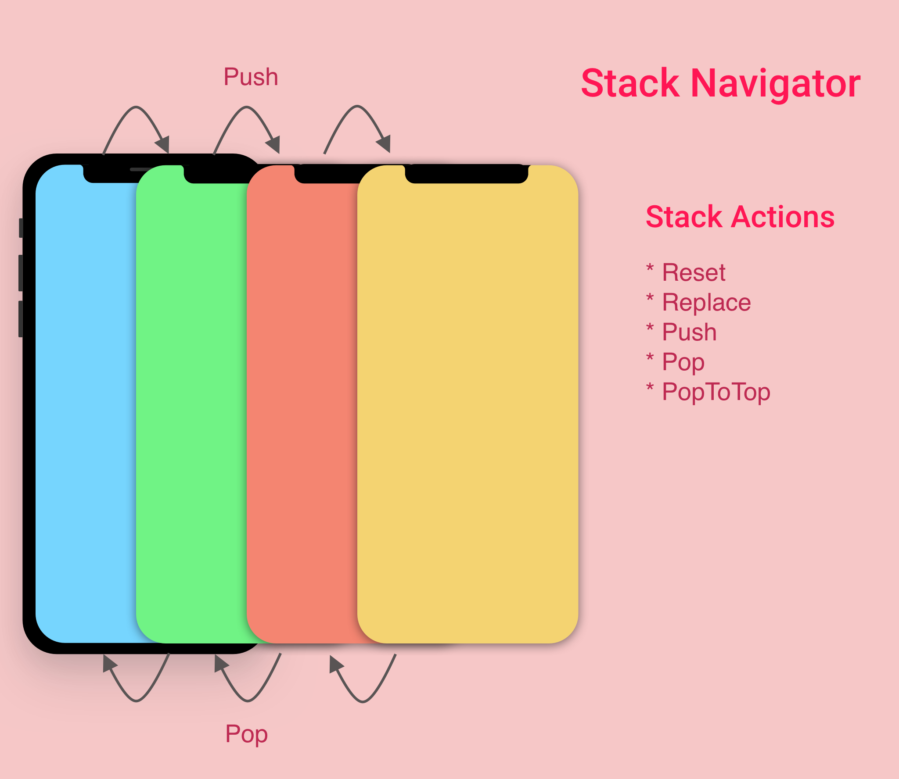
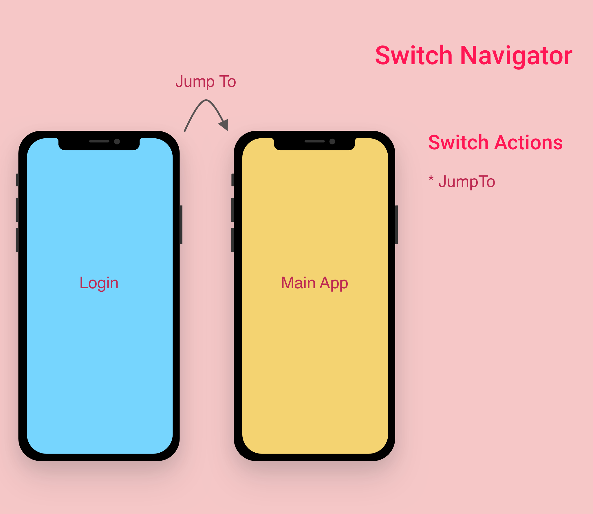
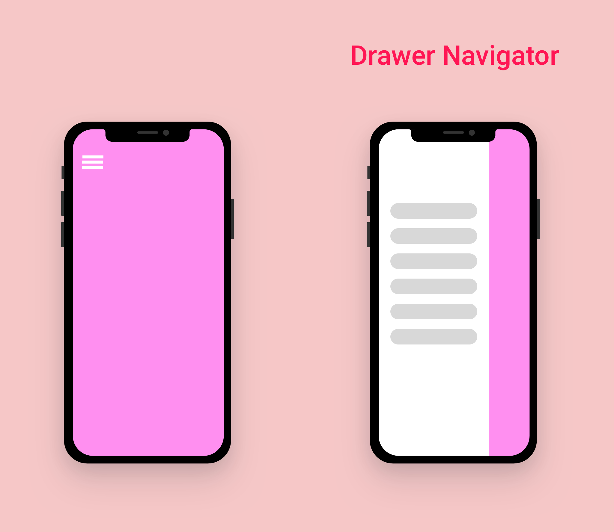
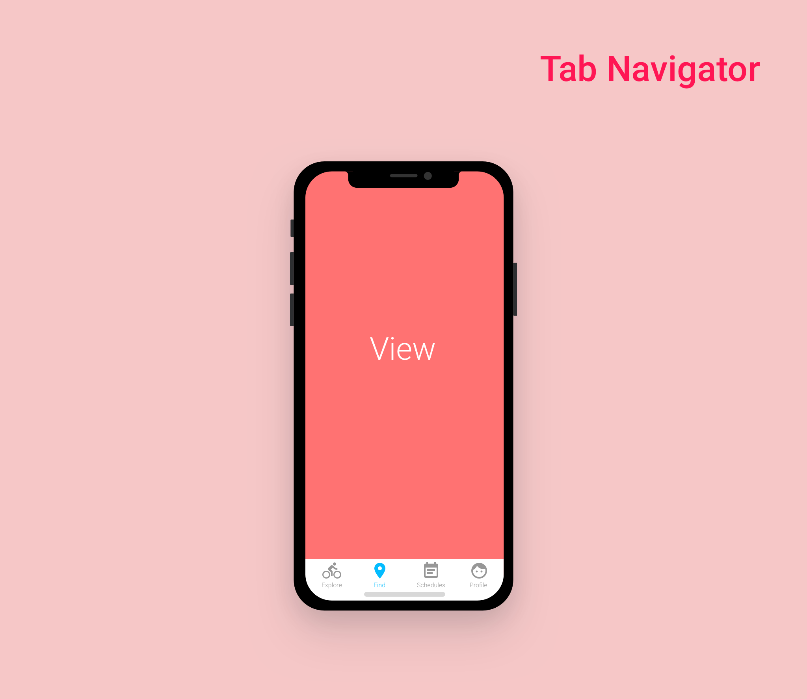
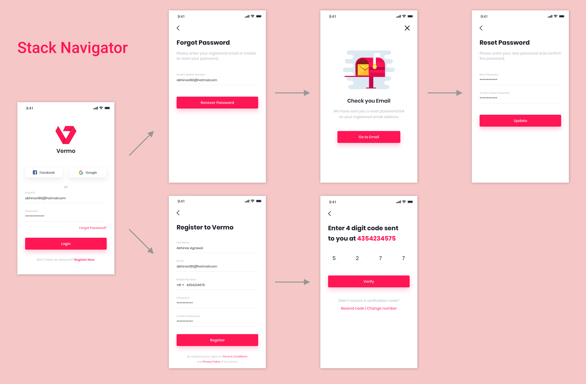
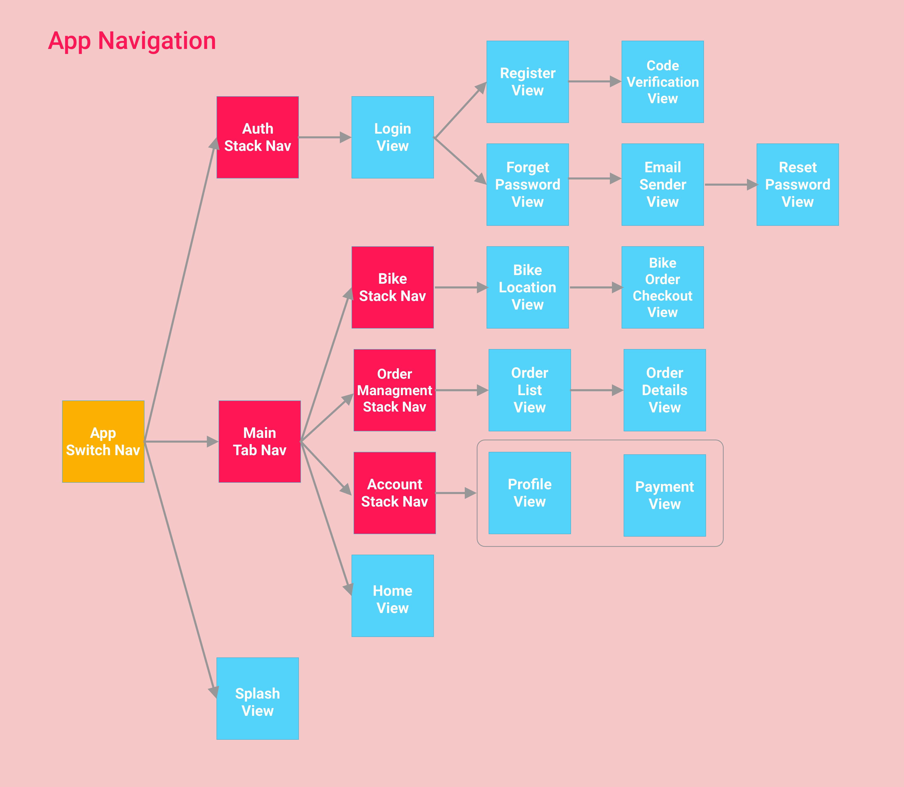

# React Native Workshop

In this course we will see the fundamental concepts of react native

### Table of Contents

+ [Values & Types](#values-and-types)

## What is React Native

React Native is a framework created by Facebook to enable a smooth and easy cross-platform mobile development.   

React Native helps you create real and exciting mobile apps with the help of JavaScript only, which is supportable for both platforms (**iOS and Android**).

>It basically means that you don’t have to create an iOS and Android app separately.

## Why?

+ It’s got ios and android covered
+ Reusable components allow hybrid apps to render natively
+ Apply react native ui components to an existing app’s code—without any rewriting at all

## How?

Give me a **state** and a **_render()_** method that depends on it and forget about how and when to render.*

>Unless you want more control

## ¿React & React Native?

React Native

+ Is a **framework** (it comes with everything you need to develop)
+ It doesn't use html, it provides **components** that work similar way than **html elements** 
+ The react native components map the actual real native **iOS or Android UI** components
+ To run your app, we will need to have **Xcode** (for iOS) and **Android Studio** (for android), _and emulators or physical devices_
+ The styling is achieve with **style sheets in Javascript**
+ Routing is achieved with `react navigation` (for Mobile development)
+ **Platform specific code** for both _platforms iOS and Android_

~~~jsx
// React Base Modules
import React from 'react';
// Only for react native
import { View, Text, StyleSheet } from 'react-native';

export default class App extends React.Component {
  render() {
    return (
      <View style={styles.container}>
        <Text >Hello world!</Text>
      </View>
    );
  }
}

const styles = StyleSheet.create({
	container: {
    flex: 1
    , backgroundColor: 'black'
    , color: '#FFFFFF'
	}
});
~~~

React 

+ It's a **library** for UI (you have to use it in complement with other libraries like **webpack**, google closure compiler, **redux**, mobx, react router, react mini router, **babel**, **polyfills**)
+ It uses the **DOM**
+ Styling is achieved with **CSS**
+ Routing is achieved with `react router` (for Web)
+ **Platform specific code** term _doesn't exists_

~~~jsx
// React Base Modules
import React from 'react';

class HelloMessage extends React.Component {
  render() {
    return (
      

        Hello {this.props.name}
      

    );
  }
}
~~~

## Starting a project

## Expo and React Native (_Vanilla_)

**Why Expo?**

Expo is really great when you are starting with mobile apps, at first pure React Native (_Vanilla_) feels overwhelming, with all that tooling you need to install and learn.

Expo is a set of tools, libraries and services that allow you develop native apps for iOS and Android written in js.

Advantages:

* Fast and simple project installation (in just several minutes)
* An utility Expo CLI opens in a browser and helps to check app status
* **Expo client app**, is an app and it allows opening projects during development without build via **XCode** or **Android Studio**
* **_Expo SDK_ offers the collection of ready solutions**
* OTA Updates
* Develop apps for ios Without macOS with ios device and test them with Expo client
>"The Ruby on Rails for React Native"

Drawbacks:

* You can't add native modules written in Objective-C, Swift, Java, Kotlin
* You cant use packages with native languages that require **linking**
* Thje app has a big size as it is built with all **Expo SDK solution.**
* Often everything works well in Expo client during testing, but certain problems may occur in a standalone app
* Dependence on Expo infrastructure
* Dependence on a particular React Native version

Development Requirements:  
+ Node.js (_latest version_ at moment of writing this _10.15.3_ for **LTS** and _12.1.0_ for **current**)
+ Git (_latest version_ at moment of writing this _2.21.0_)
+ Install [Expo](https://play.google.com/store/apps/details?id=host.exp.exponent "Expo") app on your iOS or Android phone
+ Physical device for testing purposes

\* Only mac users install `watchman`

#### Getting Start

1. Install Expo CLI

  ~~~console
  ~$ npm install -g expo-cli
  ~~~

2. Create a new React Native project called _"MyHybridApp"_

  ~~~console
  ~$ expo init MyHybridApp
  ~~~

3. Change to the new project folder and start the development server.

~~~console
~/MyHybridApp$ npm start
~~~

4. The last step will open a web development console, after that open _**expo** app_ on your mobile and **scan** the **QR** code provided by the web console, this will open the app on your physical device

### React Native

React Native is like React, but it uses native components instead of web components as building blocks. So to understand the basic structure of a React Native app, you need to understand some of the basic React concepts, like **JSX**, **components**, **state**, and **props**. If you already know React, you still need to learn some React-Native-specific stuff, like the native components.

Advantages:

* You can add native modules written in Objective-C, Swift, Java, Kotlin, and packages that require linking
* You can decide by yourself what React Native version to use
* You depend on your local environment
* You can use native modules (you can link the packages written in native languages)

Drawbacks:

* You won't have an opportunity to develop iOS without macOS, as you have to use XCode
* If you have started to work with React Native recently or have switched to it from Expo, setting a project will take a fair amount of time.

Development Requirements:  
+ Node.js (_latest version_ at moment of writing this _10.15.3_ for **LTS** and _12.1.0_ for **current**)
+ Git (_latest version_ at moment of writing this _2.21.0_)
+ Java (_8.2.11_)
+ Android Studio IDE
  + SDK Manager
  + Emulator
+ XCode IDE
+ Physical or virtual device
+ [Additional Software](https://facebook.github.io/react-native/docs/getting-started)

>Ejecting to ExpoKit
>
>ExpoKit is an Objective-C and Java library that allows you to use the Expo platform and your existing Expo project as part of a larger standard native project -- one that you would normally create using Xcode, Android Studio, or react-native init

#### Getting Start

1. Install React Native CLI

~~~console
$ npm install -g react-native-cli
~~~

2. Configure android or ios local development requirements

[React native Guide](https://facebook.github.io/react-native/docs/getting-started)

3. Create a new application

~~~console
$ react-native init MyHybridApp
~~~

4. Change to the new project folder and start the development server.

~~~console
~/MyHybridApp$ react-native run-android
~~~

## Props

Components usually can be customized when they are created with different parameteres

>Props are Unchangeable — Immutable

~~~jsx
import React from 'react';
import { AppRegistry, Text, View } from 'react-native';

class Greeting extends React.Component {
  render() {
    return (
      <View style={{ alignItems: 'center' }}>
        <Text>Hello {this.props.name}!</Text>
      </View>
    );
  }
}
~~~

_Usage:_

`<Gretting name='Oscar'>`

## State

There are two types of data that control a component: props and state. props are set by the parent and they are fixed throughout the lifetime of a component. State works differently when compared to props. State is internal to a component, while props are passed to a component.

You should initialize state in the **constructor**, and then call `setState` when you want to change it.

>State can Change — Mutable

~~~jsx
import React from 'react';
import { } from 'react-native';

class Counter extends React.Component{
  
  constructor(props){
    super(props);
    //Initialize state
    this.state = { counter: 0 };
  }

  addToCounter= ()=>{
    const counter = ++this.state.counter
    
    //Mutating the state
    this.setState({
      counter
    })
  }

  render(){
    <View>
      <Text>{ this.state.counter }<Text/>
      <Button onPress={ addToCounter }/>
    </View>
  }
} 

~~~

## Style

With React Native, you don't use a special language or syntax for defining styles. You just style your application using JavaScript. All of the core components accept a prop named style. The style names and values usually match how CSS works on the web, except names are written using camel casing, e.g `backgroundColor` rather than backgrond-color

~~~jsx
import React from 'react';
import { StyleSheet, Text, View } from 'react-native';

const styles = StyleSheet.create({
  bigGreen: {
    color: 'green',
    fontWeight: 'bold',
    fontSize: 30,
  },
  yellow: {
    color: 'yellow',
  },
});

export default class StyleExamples extends Component {
  render() {
    return (
      <View>
        <Text style={styles.yellow}>Yellow</Text>
        <Text style={styles.bigGreen}>Big Green!</Text>
        <Text style={[styles.bigGreen, styles.yellow]}>Big Green, then Yellow</Text>
        <Text style={[styles.yellow, styles.bigGreen]}>Yellow, then Big Green</Text>
      </View>
    );
  }
}
~~~

### Height and Width

A component's height and width determine its size on the screen. The simplest way to set the dimensions of a component is by adding a fixed width and height to style. All dimensions in React Native are unitless, and represent density-independent pixels.

~~~jsx
import React, { Component } from 'react';
import { View } from 'react-native';

export default class FixedDimensionsBasics extends Component {
  render() {
    return (
      <View>
        <View style={{ width: 50, height: 50, backgroundColor: 'powderblue'}} />
        <View style={{ width: 100, height: 100, backgroundColor: 'skyblue'}} />
        <View style={{ width: 150, height: 150, backgroundColor: 'steelblue'}} />
      </View>
    );
  }
}
~~~

Use Constants (**Dimensions**)

~~~jsx
import React from 'react';
import { Dimensions } from 'react-native';

const windowSize = Dimensions.get('window');

class myContainer extends React.Component{
  render(){
    return(
      <View style={ styles.container }>
      </View>
    )
  }
}

const styles = StyleSheet.create({
  container: {
    height: windowSize.height
    , width: windowSize.width
    , backgroundColor: 'white'
  }
});

~~~

Use Constants (**Absolute Fill from _StyleSheet_ Object**)

~~~jsx
import React from 'react';
import { View, StyleSheet } from 'react-native';

class myContainer extends React.Component{
  render(){
    return(
      <View style={ styles.container }>
      </View>
    )
  }
}

const styles = StyleSheet.create({
  container: {
    ...StyleSheet.absoluteFill
    , backgroundColor: 'red'
  }
});

~~~

## Layout and Flexbox

**Flex**

Use flex in a component's style to have the component expand and shrink dynamically based on available space. Normally you will use flex: 1, which tells a component to fill all available space, shared evenly amongst other components with the same parent.

+ flexDirection 
  + enum(`column`,`row`)
+ justifyContent 
  + enum(`flex-start`, `flex-end`, `center`, `space-around`, `space-between`)
+ alignItems
  + enum(`flex-start`, `flex-end`, `center`, `space-around`, `space-between`)
+ alignSelf
  + enum(`auto`, `flex-start`,`flex-end`, `center`, `stretch`, `baseline`)
+ flex 
  + number
+ flexWrap
  + enum(`nowrap`, `wrap`)
+ alignContent
  + enum(`flex-start`, `flex-end`, `center`, `space-around`, `space-between`)
+ flexBasis
  + number (_percent %_)
+ flexGrow
  + number (relative to the rest of the flexible items)
+ flexShrink
  + number (relative to the rest of the flexible items)

## Handling Text Input

`TextInput` is a basic component that allows the user to enter text. It has an onChangeText prop that takes a function to be called every time the text changed, and an onSubmitEditing prop that takes a function to be called when the text is submitted.

~~~jsx
import React, { Component } from 'react';
import { AppRegistry, Text, TextInput, View } from 'react-native';

export default class PizzaTranslator extends Component {
  constructor(props) {
    super(props);
    this.state = {text: ''};
  }

  render() {
    return (
      <View style={{padding: 10}}>
        <TextInput
          style={{height: 40}}
          placeholder="Type here to translate!"
          onChangeText={(text) => this.setState({text})}
        />
        <Text style={{padding: 10, fontSize: 42}}>
          {this.state.text.split(' ').map((word) => word && '🍕').join(' ')}
        </Text>
      </View>
    );
  }
}
~~~

## Handing Touches

Users interact with mobile apps mainly through touch. They can use a combination of gestures, such as tapping on a button, scrolling a list, or zooming on a map. React Native provides components to handle all sorts of common gestures, as well as a comprehensive gesture responder system to allow for more advanced gesture recognition

**Touchables**

If the basic button doesn't look right for your app, you can build your own button using any of the "Touchable" components provided by React Native. The "Touchable" components provide the capability to capture tapping gestures, and can display feedback when a gesture is recognized. These components do not provide any default styling, however, so you will need to do a bit of work to get them looking nicely in your app.

+ **TouchableHighlight**: On press down, the opacity of the wrapped view is decreased, which allows the underlay color to show through, darkening or tinting the view.
+ **TouchableNativeFeedback**: A wrapper for making views respond properly to touches (**Android only**). On Android this component uses native state drawable to display touch feedback.
+ **TouchableOpacity**: A wrapper for making views respond properly to touches. On press down, the opacity of the wrapped view is decreased, dimming it.
+ **TouchableWithoutFeedback**: Do not use unless you have a very good reason. All elements that respond to press should have a visual feedback when touched.s

## Navigation

React Navigation is born from the React Native community's need for an extensible yet easy-to-use navigation solution written entirely in JavaScript (so you can read and understand all of the source), on top of powerful native primitives.

### Stack Navigator

Provides a way for your app to transition between screens where each new screen is placed on top of a stack.

### Switch Navigator

The purpose of SwitchNavigator is to only ever show one screen at a time. By default, it does not handle back actions and it resets routes to their default state when you switch away.

This is the exact behavior that we want for an authentication flow.

### Drawer Navigator

This navigation method provide a way to directly switch between different screens via a drawer. This slide drawer contains links to different screens of the application.

### Bottom Navigator

A simple tab bar on the bottom of the screen that lets you switch between different routes. Routes are lazily initialized -- their screen components are not mounted until they are first focused.

E.g. "**Stack Navigator**"

E.g. "**Complete App Navigation**"

## Networking

Many mobile apps need to load resources from a remote URL. You may want to make a POST request to a REST API, or you may simply need to fetch a chunk of static content from another server.

React Native provides the Fetch API for your networking needs. Fetch will seem familiar if you have used **XMLHttpRequest** or other networking APIs before

The XMLHttpRequest API is built in to React Native. This means that you can use third party libraries such as frisbee or axios that depend on it, or you can use the XMLHttpRequest API directly if you prefer.

~~~jsx
import React from 'react';
import { FlatList, ActivityIndicator, Text, View  } from 'react-native';
import axios from 'axios';

export default class FetchExample extends React.Component {

  constructor(props){
    super(props);
    this.state ={ isLoading: true}
  }

  componentDidMount(){

    fetch('https://facebook.github.io/react-native/movies.json')
    .then((response) => response.json())
    .then((responseJson) => {

      this.setState({
        isLoading: false,
        dataSource: responseJson.movies,
      }, function(){

      });

    })
    .catch((error) =>{
      console.error(error);
    });

    axios.get(
      'https://facebook.github.io/react-native/movies.json'
    ).then(responseJson=>{
      this.setState({
        isLoading: false,
        dataSource: responseJson.movies,
      }, function(){

      });
    }).catch(error=>{
      console.error(error)
    });

  }

  render(){

    if(this.state.isLoading){
      return(
        <View style={{flex: 1, padding: 20}}>
          <ActivityIndicator/>
        </View>
      )
    }

    return(
      <View style={{flex: 1, paddingTop:20}}>
        <FlatList
          data={this.state.dataSource}
          renderItem={({item}) => <Text>{item.title}, {item.releaseYear}</Text>}
          keyExtractor={({id}, index) => id}
        />
      </View>
    );
  }
}
~~~

## React Main Concepts

Guides

---

## Components and APIs

Most apps will end up using one of these basic components. You'll want to get yourself familiarized with all of these if you're new to React Native.

### Components

* View
* Text
* Image
* TextInput
* ScrollView
* StyleSheet

### User Interface

* Button
* Picker
* Slider
* Switch

### List Views

* FlatList
* SectionList

### [iOS Components and APIs](https://facebook.github.io/react-native/docs/components-and-apis#ios-components-and-apis)

### [Android Components and APIs](https://facebook.github.io/react-native/docs/components-and-apis#android-components-and-apis)

### [Others](https://facebook.github.io/react-native/docs/components-and-apis#others)

##  Platform Specific Code

When building a cross-platform app, you'll want to re-use as much code as possible. Scenarios may arise where it makes sense for the code to be different, for example you may want to implement separate visual components for iOS and Android.

React Native provides two ways to easily organize your code and separate it by platform:

+ Using the Platform module  
  
  e.g.
  ~~~jsx
  import {Platform, StyleSheet} from 'react-native';

  const styles = StyleSheet.create({
    height: Platform.OS === 'ios' ? 200 : 100,
  });
  ~~~
  e.g.
  ~~~jsx
  import {Platform, StyleSheet} from 'react-native';

  const styles = StyleSheet.create({
    container: {
      flex: 1,
      ...Platform.select({
        ios: {
          backgroundColor: 'red',
        },
        android: {
          backgroundColor: 'blue',
        },
      }),
    },
  });
  ~~~
  + Detecting the Android version
  
  On Android, the **Platform** module can also be used to detect the version of the Android Platform in which the app is running:
  
  ~~~jsx
  import {Platform} from 'react-native';

  if (Platform.Version === 25) {
    console.log('Running on Nougat!');
  }
  ~~~~

  + Detecting the iOS version
  
  On iOS, the Version is a result of -[UIDevice systemVersion], which is a string with the current version of the operating system. An example of the system version is "10.3". For example, to detect the major version number on iOS:
  
  ~~~jsx
  import {Platform} from 'react-native';

  const majorVersionIOS = parseInt(Platform.Version, 10);
  if (majorVersionIOS <= 9) {
    console.log('Work around a change in behavior');
  }
  ~~~

+ Using platform-specific file extensions

When your platform-specific code is more complex, you should consider splitting the code out into separate files. React Native will detect when a file has a .ios. or .android. extension and load the relevant platform file when required from other components.

For example, say you have the following files in your project:

~~~
BigButton.ios.js
BigButton.android.js
~~~

You can then require the component as follows:

~~~jsx
import BigButton from './BigButton';
~~~

React Native will automatically pick up the right file based on the running platform.

## ScrollView

The ScrollView is a generic scrolling container that can host multiple components and views. The scrollable items need not be homogeneous, and you can scroll both vertically and horizontally (by setting the horizontal property).

~~~jsx
import React, { Component } from 'react';
import { AppRegistry, ScrollView, Image, Text } from 'react-native';

export default class IScrolledDownAndWhatHappenedNextShockedMe extends Component {
  render() {
      return (
        <ScrollView>
          <Text style={{fontSize:96}}>Scroll me plz</Text>
          <Image source={{uri: "https://facebook.github.io/react-native/img/favicon.png", width: 64, height: 64}} />
          <Image source={{uri: "https://facebook.github.io/react-native/img/favicon.png", width: 64, height: 64}} />
          <Image source={{uri: "https://facebook.github.io/react-native/img/favicon.png", width: 64, height: 64}} />
          <Image source={{uri: "https://facebook.github.io/react-native/img/favicon.png", width: 64, height: 64}} />
          <Image source={{uri: "https://facebook.github.io/react-native/img/favicon.png", width: 64, height: 64}} />
          <Text style={{fontSize:96}}>If you like</Text>
          <Image source={{uri: "https://facebook.github.io/react-native/img/favicon.png", width: 64, height: 64}} />
          <Image source={{uri: "https://facebook.github.io/react-native/img/favicon.png", width: 64, height: 64}} />
          <Image source={{uri: "https://facebook.github.io/react-native/img/favicon.png", width: 64, height: 64}} />
          <Image source={{uri: "https://facebook.github.io/react-native/img/favicon.png", width: 64, height: 64}} />
          <Image source={{uri: "https://facebook.github.io/react-native/img/favicon.png", width: 64, height: 64}} />
          <Text style={{fontSize:96}}>Scrolling down</Text>
          <Image source={{uri: "https://facebook.github.io/react-native/img/favicon.png", width: 64, height: 64}} />
          <Image source={{uri: "https://facebook.github.io/react-native/img/favicon.png", width: 64, height: 64}} />
          <Image source={{uri: "https://facebook.github.io/react-native/img/favicon.png", width: 64, height: 64}} />
          <Image source={{uri: "https://facebook.github.io/react-native/img/favicon.png", width: 64, height: 64}} />
          <Image source={{uri: "https://facebook.github.io/react-native/img/favicon.png", width: 64, height: 64}} />
          <Text style={{fontSize:96}}>What's the best</Text>
          <Image source={{uri: "https://facebook.github.io/react-native/img/favicon.png", width: 64, height: 64}} />
          <Image source={{uri: "https://facebook.github.io/react-native/img/favicon.png", width: 64, height: 64}} />
          <Image source={{uri: "https://facebook.github.io/react-native/img/favicon.png", width: 64, height: 64}} />
          <Image source={{uri: "https://facebook.github.io/react-native/img/favicon.png", width: 64, height: 64}} />
          <Image source={{uri: "https://facebook.github.io/react-native/img/favicon.png", width: 64, height: 64}} />
          <Text style={{fontSize:96}}>Framework around?</Text>
          <Image source={{uri: "https://facebook.github.io/react-native/img/favicon.png", width: 64, height: 64}} />
          <Image source={{uri: "https://facebook.github.io/react-native/img/favicon.png", width: 64, height: 64}} />
          <Image source={{uri: "https://facebook.github.io/react-native/img/favicon.png", width: 64, height: 64}} />
          <Image source={{uri: "https://facebook.github.io/react-native/img/favicon.png", width: 64, height: 64}} />
          <Image source={{uri: "https://facebook.github.io/react-native/img/favicon.png", width: 64, height: 64}} />
          <Text style={{fontSize:80}}>React Native</Text>
        </ScrollView>
    );
  }
}

// skip these lines if using Create React Native App
AppRegistry.registerComponent(
  'AwesomeProject',
  () => IScrolledDownAndWhatHappenedNextShockedMe);

~~~

## List Views

React Native provides a suite of components for presenting lists of data. Generally, you'll want to use either FlatList or SectionList.

The FlatList component displays a scrolling list of changing, but similarly structured, data. FlatList works well for long lists of data, where the number of items might change over time. Unlike the more generic ScrollView, the FlatList only renders elements that are currently showing on the screen, not all the elements at once.

The FlatList component requires two props: data and renderItem. data is the source of information for the list. renderItem takes one item from the source and returns a formatted component to render.

~~~jsx
import React, { Component } from 'react';
import { AppRegistry, FlatList, StyleSheet, Text, View } from 'react-native';

export default class FlatListBasics extends Component {
  render() {
    return (
      <View style={styles.container}>
        <FlatList
          data={[
            {key: 'Devin'},
            {key: 'Jackson'},
            {key: 'James'},
            {key: 'Joel'},
            {key: 'John'},
            {key: 'Jillian'},
            {key: 'Jimmy'},
            {key: 'Julie'},
          ]}
          renderItem={({item}) => <Text style={styles.item}>{item.key}</Text>}
        />
      </View>
    );
  }
}

const styles = StyleSheet.create({
  container: {
   flex: 1,
   paddingTop: 22
  },
  item: {
    padding: 10,
    fontSize: 18,
    height: 44,
  },
})

// skip this line if using Create React Native App
AppRegistry.registerComponent('AwesomeProject', () => FlatListBasics);

~~~

